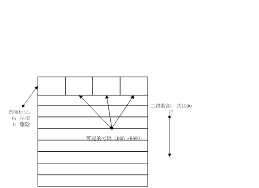

# 项目——福彩3D彩票预测软件
2014年	Microsoft Visual Studio 2013
## 需求：
根据以往的开奖数据，得出其中的规律，根据选号经预测下一期的开奖号码（学过概率的都知道是在扯淡）。

## 杀号规则：

### 杀百位
开奖号的百位乘以3加3后取个位杀下期百位
>  
开奖号的百位乘以7加7后取个位杀下期百位

### 杀十位
当期期数尾+4，杀十位
>  
上期十位杀本期十位

### 杀各位
和值尾+4,杀个位
>  
上期十位杀本期个位

## 思路：
1、 前置条件需要往期的开奖数据；需要选号经的选号规则。
>  
2、	开发思路：
>  
a)	读取往期开奖数据
>  
b)	按照一定的规则去组织这些开奖数据
>  
c)	根据选号规则分别实现不同的规则函数，并筛选号码
>  
d)	输出选号的号码。
>  
3、	设计思路：
>  
a)	分析数据格式，输入文件为文本文件，每一期开奖数据为一行，每行为五列，含义分别是：开奖日期、开奖期数、中奖号码的三个数字。得出结论：读取数据文件的方式是使用文本模式读取，数据分割符号为tab（\t）
>  
b)	因为需要分析往期的历史数据，我们需要一个二维数组形式结构来保存数据。数据用四列n行的数组来保存，分别保存开奖期数和中奖号码的三个数字。
>  
c)	输出的数据格式也应该是一个二维数组。分别是：序号和预测的三个数字。
>  
d)	根据杀号规则的定义，从所有可能的号码中将符合杀号规则的号码去掉。数据结构的定义：使用一个1000行4列的数组保存可能的号码，每列定义分别是删除标记、和可能的三位数字。
>  
>  
>  
e)	杀号规则，每一个杀号规则对应一个函数，需要一个主处理函数来维护杀号流程。已经被筛选掉的号码不应该再做处理。
>  
f)	生成输出数据：将可能的号码中没有被杀掉的号复制到c中表述的数据结构中。
